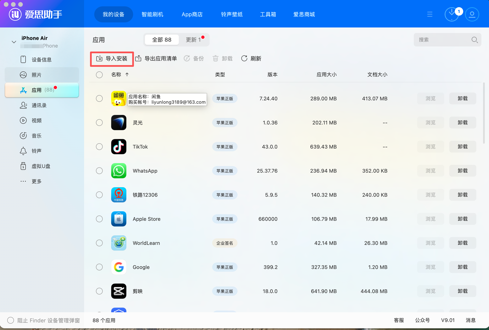

# TurboMeta - RayBan Meta 智能眼镜 AI 助手

<div align="center">


**🌏 全球首个支持全中文AI的全模态 RayBan Meta 助手**

[](https://www.apple.com/ios/)
[](https://swift.org)
[](LICENSE)
[](https://github.com/Turbo1123/turbometa-rayban-ai/releases)

[English](./README.md) | 简体中文

</div>

## 📥 下载安装

> **无需上架 App Store** - 下载 IPA 后使用签名工具自签安装

| 版本 | 下载链接 | 大小 |
|------|----------|------|
| v1.0.0 | [**TurboMeta_unsigned.ipa**](https://github.com/Turbo1123/turbometa-rayban-ai/releases/download/v1.0.0/TurboMeta_unsigned.ipa) | 6.0 MB |

### 安装工具推荐

| 工具 | 平台 | 说明 |
|------|------|------|
| [爱思助手](https://www.i4.cn/) | Windows | 国内用户首选，简单易用 |
| [AltStore](https://altstore.io/) | macOS/Windows | 免费，需要 Apple ID |
| [Sideloadly](https://sideloadly.io/) | macOS/Windows | 免费，操作简单 |
| Xcode | macOS | 从源码编译安装 |

### 爱思助手安装教程（推荐）

**第一步**：打开爱思助手，选择「工具箱」→「IPA 签名」


**第二步**：添加 IPA 文件，使用 Apple ID 进行签名


**第三步**：签名完成后，回到「应用游戏」→「导入安装」，选择签名后的 IPA 安装



**第四步**：在 iPhone 上打开 **设置 → 通用 → VPN与设备管理**，信任开发者证书

**第五步**：打开 TurboMeta，在设置中配置你的阿里云 API Key

## 📖 简介

TurboMeta 是专为 RayBan Meta 智能眼镜打造的全模态AI助手，集成了阿里云通义千问多模态大模型，实现了：

- 🎯 **实时AI对话**：通过眼镜摄像头和麦克风进行多模态实时交互
- 🍎 **智能营养分析**：拍摄食物即可获得详细的营养成分和健康建议
- 👁️ **图像识别**：智能识别眼前的物体、场景和文字
- 🎥 **直播推流**：支持抖音、快手、小红书等平台的直播功能
- 🌐 **完整中文支持**：全中文AI交互体验，完美适配中文用户

这是全球第一个实现**完全中文化**的 RayBan Meta AI 助手，让中文用户也能享受到智能眼镜带来的便利。

## ✨ 核心功能

### 🤖 Live AI - 实时对话
- **多模态交互**：同时支持语音和视觉输入
- **实时响应**：基于通义千问 Omni-Realtime 模型，低延迟语音对话
- **场景理解**：AI 能看到你眼前的画面并提供相关建议
- **口语化回复**：自然流畅的中文对话体验
- **一键隐藏**：支持隐藏对话界面，专注于视觉体验

### 🍽️ LeanEat - 智能营养分析
- **食物识别**：拍照即可识别食物种类
- **营养成分**：详细的热量、蛋白质、脂肪、碳水化合物等数据
- **健康评分**：0-100分的健康评分系统
- **营养建议**：AI提供的个性化营养建议
- **美观界面**：精心设计的UI，清晰展示营养信息

### 📸 实时拍照
- **自动启动**：打开界面自动连接眼镜并开始预览
- **多功能集成**：拍照后可选择营养分析或AI识别
- **流畅体验**：实时视频流预览

### 🎥 直播功能
- **平台支持**：适配主流直播平台
- **简洁界面**：专注于直播内容的纯净视图

## 🛠️ 技术栈

- **平台**：iOS 17.0+
- **语言**：Swift 5.0 + SwiftUI
- **SDK**：Meta Wearables DAT SDK v0.3.0
- **AI模型**：
  - 通义千问 Omni-Realtime：实时多模态对话
  - 通义千问 VL-Plus：视觉理解和图像分析
- **架构**：MVVM + Combine
- **音频**：AVAudioEngine + AVAudioPlayerNode

## 📋 前置要求

### 硬件要求
- ✅ RayBan Meta 智能眼镜（Stories 或最新款）
- ✅ iPhone（iOS 17.0 或更高版本）
- ✅ 稳定的网络连接

### 软件要求
- ✅ Xcode 15.0 或更高版本
- ✅ Meta View App（用于配对眼镜）
- ✅ 阿里云账号（申请 API）

### API 要求
需要申请以下阿里云 API：
1. **通义千问 Omni-Realtime API**：用于实时对话
2. **通义千问 VL-Plus API**：用于图像识别和营养分析

👉 [前往阿里云申请 API](https://dashscope.aliyun.com/)

## 🚀 安装指南

### 步骤 1：开启 RayBan Meta 开发者模式

⚠️ **重要**：由于当前处于 Preview 阶段，必须开启开发者模式才能使用。

1. 在 iPhone 上打开 **Meta View App**（或 **Meta AI App**）
2. 进入 **设置** → **应用信息** 或 **关于**
3. 找到 **版本号**
4. **连续点击版本号 5 次**
5. 会出现"开发者模式已开启"的提示

### 步骤 2：配置 API Key

1. 前往 [阿里云 DashScope](https://dashscope.aliyun.com/)
2. 登录并创建 API Key
3. 在项目中打开 `VisionAPIConfig.swift`
4. 替换你的 API Key：

```swift
struct VisionAPIConfig {
    static let apiKey = "sk-YOUR-API-KEY-HERE"
}
```

### 步骤 3：编译项目

1. 用 Xcode 打开 `CameraAccess.xcodeproj`
2. 选择你的开发团队（Team）
3. 修改 Bundle Identifier（如果需要）
4. 连接你的 iPhone
5. 点击 **Run** 或按 `Cmd + R`

### 步骤 4：签名和安装

#### 方法 A：使用 Xcode 直接安装（推荐）
1. 在 Xcode 中选择你的 iPhone 设备
2. 点击 Run 按钮
3. 首次运行需要在 iPhone 设置中信任开发者

#### 方法 B：导出 IPA 并自签名
1. 在 Xcode 中选择 **Product** → **Archive**
2. 导出 IPA 文件
3. 使用 AltStore、Sideloadly 或其他工具进行签名安装

```bash
# 使用 ios-deploy (需要安装)
brew install ios-deploy
ios-deploy --bundle YourApp.app
```

### 步骤 5：配对眼镜

1. 打开 Meta View App
2. 配对你的 RayBan Meta 眼镜
3. 确保蓝牙已开启
4. 返回 TurboMeta App，等待连接成功

## 📱 使用指南

### 首次使用

1. 启动 TurboMeta App
2. 确保 RayBan Meta 眼镜已配对并开启
3. 等待设备连接（顶部会显示连接状态）
4. 选择你想使用的功能

### Live AI 实时对话

1. 点击首页的 **Live AI** 卡片
2. 等待连接成功（右上角显示绿点）
3. 开始说话，AI 会实时回复
4. AI 可以看到你眼前的画面
5. 点击 👁️ 按钮可以隐藏对话记录

**使用技巧**：
- 说话清晰，保持适当距离
- 可以问"你看到了什么？"让 AI 描述画面
- AI 会用简练的中文回答

### LeanEat 营养分析

1. 点击首页的 **LeanEat** 卡片
2. 对准食物，点击拍照按钮 📷
3. 在照片预览中点击 **营养分析**
4. 等待 AI 分析完成
5. 查看营养成分、健康评分和建议

**使用场景**：
- 餐前拍照，了解营养成分
- 健身减脂时记录每日摄入
- 学习食物的营养知识

### 直播功能

1. 点击首页的 **直播** 卡片
2. 等待视频流启动
3. 进行直播内容创作
4. 点击停止按钮结束直播

## 🎨 界面预览

<table>
  <tr>
    <td><b>首页</b></td>
    <td><b>Live AI</b></td>
    <td><b>营养分析</b></td>
  </tr>
  <tr>
    <td></td>
    <td></td>
    <td></td>
  </tr>
</table>

## ⚙️ 配置选项

### API 配置

在 `VisionAPIConfig.swift` 中配置：

```swift
struct VisionAPIConfig {
    // 阿里云 API Key
    static let apiKey = "sk-YOUR-API-KEY-HERE"

    // API 基础 URL（通常不需要修改）
    static let baseURL = "https://dashscope.aliyuncs.com"
}
```

### 系统提示词

可以在 `OmniRealtimeService.swift` 中自定义 AI 的回复风格：

```swift
"instructions": "你是RayBan Meta智能眼镜AI助手。回答要简练、口语化..."
```

## 🔧 常见问题

### Q1: 眼镜连接不上怎么办？

**解决方案**：
1. 确保眼镜已在 Meta View App 中配对成功
2. 检查蓝牙是否开启
3. 重启 TurboMeta App
4. 重启眼镜（放入眼镜盒充电仓）
5. 确保已开启开发者模式

### Q2: AI 没有回复或回复很慢？

**解决方案**：
1. 检查网络连接是否稳定
2. 确认 API Key 是否正确配置
3. 查看阿里云 API 额度是否充足
4. 检查控制台日志排查错误

### Q3: 营养分析结果不准确？

**解决方案**：
1. 确保食物拍摄清晰
2. 尽量在良好光线下拍摄
3. 食物尽量完整展示在画面中
4. AI 分析仅供参考，不能替代专业营养师

### Q4: 无法安装到手机？

**解决方案**：
1. 检查 iPhone 是否在信任的设备列表中
2. 确认开发者证书是否有效
3. 修改 Bundle Identifier 避免冲突
4. 使用免费的 Apple Developer 账号每 7 天需重新签名

### Q5: 语音识别不准确？

**解决方案**：
1. 确保环境相对安静
2. 说话清晰，语速适中
3. 麦克风不要被遮挡
4. 当前主要优化了中文，其他语言可能不太准确

## 🔒 隐私和安全

- ✅ 所有音视频数据仅用于 AI 处理
- ✅ 不会存储或上传用户隐私数据
- ✅ API 通信使用 HTTPS 加密
- ✅ 图片和语音仅在会话期间保留
- ✅ 遵循苹果和 Meta 的隐私政策

## 🗺️ 开发路线图

### ✅ 已完成
- [x] Live AI 实时对话
- [x] LeanEat 营养分析
- [x] 图像识别
- [x] 基础直播功能
- [x] 中英文双语支持
- [x] 对话记录保存
- [x] 一键隐藏对话

### 🚧 进行中
- [ ] 完善多语言支持
- [ ] 优化 UI/UX
- [ ] 性能优化

### 📅 计划中
- [ ] 实时翻译功能
- [ ] WordLearn 单词学习
- [ ] 云端同步对话记录
- [ ] 更多直播平台支持
- [ ] 离线模式
- [ ] Apple Watch 配套应用

## 🤝 贡献

欢迎贡献代码、报告 Bug 或提出新功能建议！

1. Fork 本项目
2. 创建功能分支 (`git checkout -b feature/AmazingFeature`)
3. 提交更改 (`git commit -m 'Add some AmazingFeature'`)
4. 推送到分支 (`git push origin feature/AmazingFeature`)
5. 开启 Pull Request

## 📄 许可证

本项目基于 Meta Platforms, Inc. 的原始代码修改而来，遵循原项目的许可证。

部分代码版权归 Meta Platforms, Inc. 及其关联公司所有。

请参阅 [LICENSE](LICENSE) 文件了解详细信息。

## 🙏 致谢

- **Meta Platforms, Inc.** - 提供 DAT SDK 和原始示例代码
- **阿里云通义千问团队** - 提供强大的多模态 AI 能力
- **RayBan** - 出色的智能眼镜硬件

## 🚀 如何开源此项目

### 1. 创建 GitHub 仓库

```bash
# 在 GitHub 网站上创建新仓库
# 然后在项目目录执行：
git init
git add .
git commit -m "Initial commit: TurboMeta - RayBan Meta AI Assistant"
git branch -M main
git remote add origin https://github.com/你的用户名/仓库名.git
git push -u origin main
```

### 2. 保护敏感信息

✅ **已完成的安全措施**：
- API Key 不再硬编码在代码中
- 使用 iOS Keychain 安全存储用户的 API Key
- 用户需在 App 内「设置」中自行配置

⚠️ **发布前检查**：
```bash
# 搜索可能残留的敏感信息
grep -r "sk-" .
grep -r "API" . | grep -i "key"
```

### 3. 添加 .gitignore 文件

在项目根目录创建 `.gitignore` 文件：

```gitignore
# Xcode
build/
*.pbxuser
*.mode1v3
*.mode2v3
*.perspectivev3
xcuserdata/
*.xccheckout
*.moved-aside
DerivedData/
*.hmap
*.ipa
*.xcuserstate
*.xcworkspace

# API Keys (额外保护)
**/*APIKey*.swift
**/APIKeys.swift
**/*Secret*.swift

# macOS
.DS_Store
```

### 4. 选择开源协议

本项目基于 Meta DAT SDK 示例代码，遵循原项目许可证。你可以：
- 保持与 Meta 相同的许可证
- 为你的代码部分选择 MIT、Apache 2.0 等许可证
- 在 LICENSE 文件中注明原始代码来源

### 5. 用户配置说明

⚠️ **重要提示**：使用本项目的用户需要：

1. **申请 API Key**：前往 [阿里云 DashScope](https://dashscope.aliyun.com/) 申请
2. **配置 API Key**：在 App「设置」→「API Key 管理」输入
3. **API Key 安全**：存储在 iOS Keychain，不会泄露

## 🌟 如果这个项目对你有帮助

- ⭐️ 给项目点个 Star
- 🐛 报告 Bug 或提出建议
- 🔀 Fork 并贡献代码
- 📢 分享给更多人

---

<div align="center">

**让智能眼镜说中文 🇨🇳**

Made with ❤️ for RayBan Meta Users

</div>
