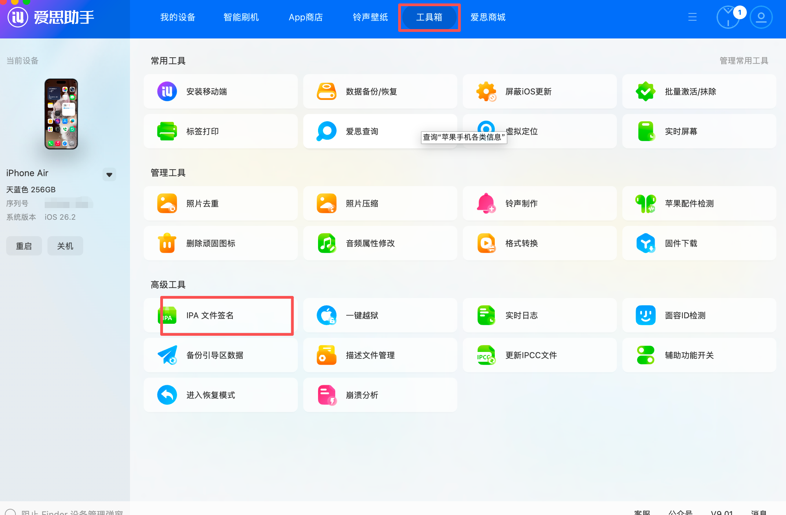
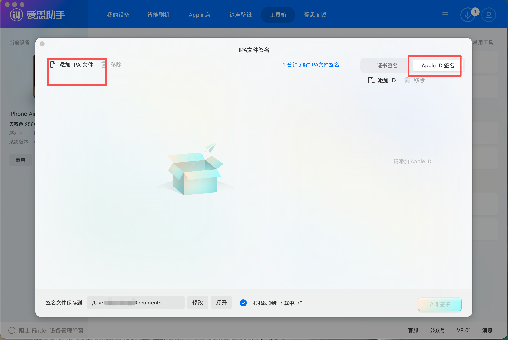

# TurboMeta - RayBan Meta Smart Glasses AI Assistant

<div align="center">


**🌏 World's First Full-Chinese AI Multimodal RayBan Meta Assistant**

[](https://www.apple.com/ios/)
[](https://www.android.com/)
[](https://swift.org)
[](https://kotlinlang.org)
[](LICENSE)
[](https://github.com/Turbo1123/turbometa-rayban-ai/releases)
[](https://buymeacoffee.com/turbo1123)

[English](./README_EN.md) | [简体中文](./README.md)

</div>

---

## 🎉 Major Update v1.5.0

<div align="center">

### 🧠 Live AI Multi-Mode + Quick Vision Multi-Mode

**Museum guide, accessibility assistant, reading mode, real-time translation - one pair of glasses, endless possibilities!**

✅ **iOS v1.5.0** | 📱 **Android v1.4.0** [Download](https://github.com/Turbo1123/turbometa-rayban-ai/releases)

☕ **Enjoying this project?** [**Buy me a coffee**](https://buymeacoffee.com/turbo1123) to support development!

</div>

> ☕ **Enjoying this project?** This is a passion project maintained in my spare time. If it's been helpful to you, consider [**buying me a coffee**](https://buymeacoffee.com/turbo1123) - it really helps keep the project going!

### 🆕 v1.5 New Features

- 🧠 **Live AI Multi-Mode**: Museum mode, Accessibility mode, Reading mode, Translation mode, Custom prompts
- 👁️ **Quick Vision Multi-Mode**: Health analysis, Encyclopedia mode, Reading mode, Translation mode
- 🗣️ **Siri Shortcuts**: Voice-activate Quick Vision and Live AI

### 🎯 Core Features

- 🎬 **RTMP Live Streaming**: Stream to any RTMP platform - YouTube, Twitch, Bilibili, Douyin, TikTok, Facebook Live, etc.
- 👁️ **Quick Vision**: Siri voice activation - identify objects without unlocking your phone
- 🤖 **Live AI**: Real-time multimodal AI conversation via glasses camera and microphone
- 🍽️ **LeanEat**: Take a photo to get nutrition analysis and health scores

### 🌐 Multi-Language & Multi-Platform

- 🌐 **Bilingual Interface**: Full English and Chinese UI support with easy switching
- 🔌 **OpenRouter Support**: Access 500+ AI models including GPT-5, Claude 4.5, Gemini 3, and more
- 🎙️ **Google Gemini Live**: Live AI now supports Google Gemini real-time voice chat (requires non-China network)
- 🌏 **Alibaba Multi-Region**: Support for Beijing (China mainland) and Singapore (International) endpoints
- 🔑 **Independent API Key Management**: Separate API keys for different providers and regions

---

## 📱 Quick Vision

<div align="center">

### 🚀 Background Wake-up + Siri Voice Trigger!

**No need to unlock your phone - just say a word and let AI identify everything in front of you**

</div>

Due to Meta DAT SDK limitations, the app cannot directly access the glasses camera in the background. We innovatively combined **Siri Shortcuts + App Intent + Alibaba Cloud TTS** to achieve this feature:

- 📱 **Siri Voice Wake-up**: Just say "Hey Siri, TurboMeta Quick Vision"
- ⌚ **Action Button Trigger** (iPhone 15 Pro+): One-tap Quick Vision
- 🔊 **Voice Result Announcement**: High-quality TTS powered by qwen3-tts-flash
- 🎯 **Fully Automated**: Start stream → Capture → Stop stream → AI Recognition → TTS Announcement

👉 [View Detailed Tutorial](#quick-vision-tutorial)

---

## 🎨 Interface Preview

<table>
  <tr>
    <td align="center"><b>首页</b><br/>Home</td>
    <td align="center"><b>对话记录</b><br/>Live AI</td>
    <td align="center"><b>拍摄页面</b><br/>Camera</td>
    <td align="center"><b>设置页面</b><br/>Settings</td>
  </tr>
  <tr>
    <td></td>
    <td></td>
    <td></td>
    <td></td>
  </tr>
</table>

## 🎬 Video Demo

<a href="https://www.bilibili.com/video/BV1aTqSBHEqN" target="_blank">
  
</a>

👉 <a href="https://www.bilibili.com/video/BV1aTqSBHEqN" target="_blank">Watch on Bilibili</a>

> 💡 If you find this project helpful, consider [**buying me a coffee**](https://buymeacoffee.com/turbo1123) ☕

## 📥 Download

> **No App Store / Google Play** - Install directly using methods below

### ⚠️ Important: Enable Developer Mode First!

Before using TurboMeta, you **MUST** enable developer mode in Meta AI App:

1. **Update RayBan Meta glasses firmware to version 20+** (required for DAT SDK)
2. **Update Meta AI App to the latest version**
3. Open **Meta AI App** on your phone
4. Go to **Settings** → **App Info**
5. Find **Version Number**
6. **Tap the version number 5 times rapidly**
7. You'll see "Developer mode enabled" message

> Without developer mode, the app will show an error when redirecting to Meta AI App!

---

### 📱 Android

👉 [**Go to Downloads**](https://github.com/Turbo1123/turbometa-rayban-ai/releases)

**Android Installation:**
1. Download APK file
2. Enable "Install from unknown sources" in Settings
3. Open APK to install
4. Grant permissions (Bluetooth, Microphone)
5. Configure API Key in Settings 👉 [See Configuration Guide](#api-key-config)

---

### 🍎 iOS (Recommended)

> ✅ Supports bilingual UI, OpenRouter, Gemini, RTMP streaming

👉 [**Go to Downloads**](https://github.com/Turbo1123/turbometa-rayban-ai/releases)

**iOS Installation Methods:**

| Tool | Platform | Description |
|------|----------|-------------|
| [AltStore](https://altstore.io/) | macOS/Windows | Free, requires Apple ID |
| [Sideloadly](https://sideloadly.io/) | macOS/Windows | Free, easy to use |
| [爱思助手 (i4Tools)](https://www.i4.cn/) | Windows | Chinese users recommended |
| Xcode | macOS | Build from source code |

### i4Tools Installation Guide (Recommended for Windows)

**Step 1**: Open i4Tools, go to "Toolbox" → "IPA Signature"



**Step 2**: Add IPA file and sign with your Apple ID



**Step 3**: After signing, go to "Apps" → "Import & Install", select the signed IPA


**Step 4**: On iPhone, go to **Settings → General → VPN & Device Management**, trust the developer certificate

**Step 5**: Open TurboMeta and configure your Alibaba Cloud API Key in Settings 👉 [See Configuration Guide](#api-key-config)

---

## 📖 Introduction

TurboMeta is a full-featured multimodal AI assistant built exclusively for RayBan Meta smart glasses, powered by Alibaba Cloud's Qwen multimodal AI models:

- 🎯 **Live AI Conversations**: Real-time multimodal interaction through glasses camera and microphone
- 🍎 **Smart Nutrition Analysis**: Capture food photos and get detailed nutritional information and health recommendations
- 👁️ **Image Recognition**: Intelligently identify objects, scenes, and text in your field of view
- 🎥 **Live Streaming**: Stream directly to platforms like Douyin, Kuaishou, and Xiaohongshu
- 🌐 **Full Chinese Support**: Complete Chinese AI interaction experience, perfectly tailored for Chinese users

This is the world's first **fully Chinese-enabled** RayBan Meta AI assistant, bringing the convenience of smart glasses to Chinese-speaking users.

## ✨ Core Features

### 👁️ Quick Vision <sup>`NEW`</sup>
- **Siri Wake-up**: Voice-triggered recognition without unlocking your phone
- **Shortcuts Integration**: Supports iOS Shortcuts automation
- **Action Button Support**: One-tap trigger on iPhone 15 Pro series
- **High-quality TTS**: Voice announcement powered by qwen3-tts-flash
- **Smart Recognition**: Based on qwen3-vl-plus multimodal visual understanding

### 🤖 Live AI - Real-time Conversations
- **Multimodal Interaction**: Simultaneous voice and visual input support
- **Real-time Response**: Based on Qwen Omni-Realtime model with low-latency voice conversations
- **Scene Understanding**: AI can see what's in front of you and provide relevant suggestions
- **Natural Responses**: Smooth and natural Chinese conversation experience
- **One-tap Hide**: Support for hiding conversation interface to focus on visual experience

### 🍽️ LeanEat - Smart Nutrition Analysis
- **Food Recognition**: Identify food types by taking photos
- **Nutritional Content**: Detailed data on calories, protein, fat, carbohydrates, etc.
- **Health Scoring**: Health scoring system from 0-100
- **Nutrition Advice**: Personalized nutritional recommendations from AI
- **Beautiful Interface**: Carefully designed UI with clear nutritional information display

### 📸 Real-time Photography
- **Auto-start**: Automatically connects to glasses and starts preview when opened
- **Multi-function Integration**: Choose nutrition analysis or AI recognition after taking photos
- **Smooth Experience**: Real-time video stream preview

### 🎥 Live Streaming
- **Platform Support**: Compatible with mainstream live streaming platforms
- **Clean Interface**: Pure view focused on streaming content

## 🛠️ Tech Stack

### iOS
- **Platform**: iOS 17.0+
- **Language**: Swift 5.0 + SwiftUI
- **SDK**: Meta Wearables DAT SDK v0.3.0
- **Architecture**: MVVM + Combine
- **Audio**: AVAudioEngine + AVAudioPlayerNode

### Android
- **Platform**: Android 8.0+ (API 26)
- **Language**: Kotlin 1.9 + Jetpack Compose
- **SDK**: Meta Wearables DAT SDK v0.3.0
- **Architecture**: MVVM + StateFlow
- **UI**: Material 3 Design

### AI Models
- **Qwen Omni-Realtime**: Real-time multimodal conversations
- **Qwen VL-Plus**: Visual understanding and image analysis
- **Qwen TTS-Flash**: High-quality Chinese text-to-speech

## 📋 Requirements

### Hardware Requirements
- ✅ RayBan Meta Smart Glasses (Stories or latest model)
- ✅ iPhone (iOS 17.0+) or Android phone (8.0+)
- ✅ Stable internet connection

### Software Requirements
- ✅ Meta View App / Meta AI App (for pairing glasses)
- ✅ Alibaba Cloud account (for API access)
- ✅ Xcode 15.0+ (iOS development)
- ✅ Android Studio (Android development)

### API Requirements
You need to apply for the following Alibaba Cloud APIs:
1. **Qwen Omni-Realtime API**: For real-time conversations
2. **Qwen VL-Plus API**: For image recognition and nutrition analysis

👉 [Apply for APIs at Alibaba Cloud Model Studio](https://www.alibabacloud.com/zh/product/modelstudio) | [Model Studio Console](https://bailian.console.alibabacloud.com/)

## 🚀 Installation Guide

### Step 1: Enable RayBan Meta Developer Mode

⚠️ **Important**: Since this is currently in Preview phase, you must enable developer mode to use it.

1. Open **Meta View App** (or **Meta AI App**) on your iPhone
2. Go to **Settings** → **App Info** or **About**
3. Find **Version Number**
4. **Tap the version number 5 times consecutively**
5. You'll see a "Developer mode enabled" message

### Step 2: Configure API Key

For detailed configuration guide, see 👉 [API Key Configuration](#api-key-config)

Quick steps:
1. Visit [Alibaba Cloud Model Studio](https://www.alibabacloud.com/zh/product/modelstudio) to register
2. Login to [Model Studio Console](https://bailian.console.alibabacloud.com/) → API-KEY Management → Create API Key
3. Enter your API Key in App "Settings" → "API Key Management"

### Step 3: Build the Project

1. Open `CameraAccess.xcodeproj` with Xcode
2. Select your development team (Team)
3. Modify Bundle Identifier (if needed)
4. Connect your iPhone
5. Click **Run** or press `Cmd + R`

### Step 4: Signing and Installation

#### Method A: Direct Installation with Xcode (Recommended)
1. Select your iPhone device in Xcode
2. Click the Run button
3. First-time run requires trusting the developer in iPhone Settings

#### Method B: Export IPA and Self-Sign
1. In Xcode, select **Product** → **Archive**
2. Export the IPA file
3. Use AltStore, Sideloadly, or other tools to sign and install

```bash
# Using ios-deploy (requires installation)
brew install ios-deploy
ios-deploy --bundle YourApp.app
```

### Step 5: Pair Your Glasses

1. Open Meta View App
2. Pair your RayBan Meta glasses
3. Ensure Bluetooth is enabled
4. Return to TurboMeta App and wait for connection success

## 📱 Usage Guide

### First-time Use

1. Launch TurboMeta App
2. Ensure RayBan Meta glasses are paired and turned on
3. Wait for device connection (status shown at top)
4. Select the feature you want to use

### Live AI Real-time Conversations

1. Tap the **Live AI** card on the home screen
2. Wait for connection success (green dot in upper right)
3. Start speaking, AI will respond in real-time
4. AI can see what's in front of you
5. Tap the 👁️ button to hide conversation history

**Tips**:
- Speak clearly and maintain appropriate distance
- Ask "What do you see?" to have AI describe the scene
- AI responds in concise Chinese

### LeanEat Nutrition Analysis

1. Tap the **LeanEat** card on the home screen
2. Point at food and tap the camera button 📷
3. In photo preview, tap **Nutrition Analysis**
4. Wait for AI analysis to complete
5. View nutritional content, health score, and recommendations

**Use Cases**:
- Take photos before meals to understand nutritional content
- Track daily intake when on a fitness diet
- Learn about food nutrition

### Live Streaming

1. Tap the **Live Stream** card on the home screen
2. Wait for video stream to start
3. Create your streaming content
4. Tap stop button to end the stream

---

<a id="quick-vision-tutorial"></a>

## 👁️ Quick Vision Tutorial

Quick Vision allows you to quickly identify objects in front of you through Siri or Shortcuts without unlocking your phone.

### 📋 Prerequisites

1. ✅ TurboMeta App installed and API Key configured
2. ✅ RayBan Meta glasses paired and turned on
3. ✅ Open TurboMeta App once for first-time initialization

### 🔧 Setting Up Shortcuts

#### Method 1: Siri Voice Trigger

1. Open the **Shortcuts** app on iPhone
2. Tap **+** in the top right to create a new shortcut
3. Tap **Add Action**
4. Search for **TurboMeta** or **Turbo Meta**
5. Select **Quick Vision** action
6. Tap the shortcut name at the top to rename it (e.g., "Quick Vision", "What's This")
7. Tap **Done** to save

**How to Use**:
- Say "Hey Siri, Quick Vision" (or your custom shortcut name)
- AI will automatically capture, recognize, and announce the result

<details>
<summary>📸 Click to view setup screenshots</summary>

1. Search for TurboMeta in Shortcuts app
2. Add "Quick Vision" action
3. Rename the shortcut

</details>

#### Method 2: iPhone 15 Pro Action Button

If you have iPhone 15 Pro / 15 Pro Max / 16 series, you can bind Quick Vision to the Action Button:

1. Open **Settings** → **Action Button**
2. Select **Shortcut**
3. Choose your TurboMeta Quick Vision shortcut
4. Done!

**How to Use**:
- Long press the Action Button to trigger Quick Vision
- No need to unlock your phone - works while wearing glasses

#### Method 3: Lock Screen Widget

1. Long press on the lock screen to enter edit mode
2. Tap **Customize**
3. Add **Shortcuts** widget to the lock screen widget area
4. Select TurboMeta Quick Vision shortcut
5. Tap Done

**How to Use**:
- Tap the widget directly on the lock screen to trigger

### 🎯 Quick Vision Workflow

```
Siri/Shortcut Trigger
        ↓
   Start Video Stream
        ↓
   Auto Capture Photo
        ↓
   Stop Video Stream
        ↓
   AI Image Recognition (qwen3-vl-plus)
        ↓
   TTS Voice Announcement (qwen3-tts-flash)
```

### 💡 Tips

- **Ensure glasses are on**: Make sure glasses aren't in the charging case
- **Stay steady**: Keep your head stable while capturing
- **Good lighting**: Better recognition in well-lit environments
- **Wait for announcement**: Recognition takes a few seconds, wait patiently for voice announcement

### ⚠️ Troubleshooting

**Q: Why does it say "Glasses not connected"?**
- Ensure glasses are on and paired with Meta View App
- Make sure developer mode is enabled
- Try reopening TurboMeta App

**Q: Why is there no sound?**
- Check if phone is on silent mode
- Check Bluetooth audio output settings
- TTS requires network connection (Alibaba Cloud service)

**Q: Can't find TurboMeta in Shortcuts?**
- Open TurboMeta App at least once after installation
- Try restarting your phone

---

## ⚙️ Configuration Options

### API Configuration

Configure in `VisionAPIConfig.swift`:

```swift
struct VisionAPIConfig {
    // Alibaba Cloud API Key
    static let apiKey = "sk-YOUR-API-KEY-HERE"

    // API Base URL (usually doesn't need modification)
    static let baseURL = "https://dashscope.aliyuncs.com"
}
```

### System Prompts

Customize AI response style in `OmniRealtimeService.swift`:

```swift
"instructions": "You are a RayBan Meta smart glasses AI assistant. Keep answers concise and conversational..."
```

## 🔧 Troubleshooting

### Q1: Glasses won't connect?

**Solutions**:
1. Ensure glasses are successfully paired in Meta View App
2. Check if Bluetooth is enabled
3. Restart TurboMeta App
4. Restart glasses (place in charging case)
5. Ensure developer mode is enabled

### Q2: AI not responding or responding slowly?

**Solutions**:
1. Check if internet connection is stable
2. Verify API Key is correctly configured
3. Check if Alibaba Cloud API quota is sufficient
4. Review console logs for errors

### Q3: Nutrition analysis results inaccurate?

**Solutions**:
1. Ensure food photos are clear
2. Take photos in good lighting
3. Show food completely in frame
4. AI analysis is for reference only, not a substitute for professional nutritionists

### Q4: Cannot install on phone?

**Solutions**:
1. Check if iPhone is in trusted devices list
2. Verify developer certificate is valid
3. Modify Bundle Identifier to avoid conflicts
4. Free Apple Developer accounts require re-signing every 7 days

### Q5: Voice recognition inaccurate?

**Solutions**:
1. Ensure environment is relatively quiet
2. Speak clearly at moderate speed
3. Don't obstruct the microphone
4. Currently optimized for Chinese, other languages may be less accurate

## 🔒 Privacy and Security

- ✅ All audio/video data is only used for AI processing
- ✅ No storage or upload of user privacy data
- ✅ API communications use HTTPS encryption
- ✅ Images and voice are retained only during session
- ✅ Complies with Apple and Meta privacy policies

## 🗺️ Roadmap

### ✅ Completed
- [x] Live AI real-time conversations
- [x] LeanEat nutrition analysis
- [x] Image recognition
- [x] Basic live streaming functionality
- [x] Bilingual Chinese/English support
- [x] Conversation history saving
- [x] One-tap hide conversations
- [x] **Android version released** 🎉
- [x] **Quick Vision** 🆕
  - [x] Siri Shortcuts integration
  - [x] App Intent support
  - [x] Alibaba Cloud TTS voice announcement
  - [x] iPhone Action Button support

### 🚧 In Progress
- [ ] Improve multilingual support
- [ ] Optimize UI/UX
- [ ] Performance optimization

### 📅 Planned
- [ ] Real-time translation feature
- [ ] WordLearn vocabulary learning
- [ ] Cloud conversation sync
- [ ] More live streaming platform support
- [ ] Offline mode
- [ ] Apple Watch companion app
- [ ] Android Quick Vision support

## 🤝 Contributing

Contributions, bug reports, and feature suggestions are welcome!

1. Fork this project
2. Create a feature branch (`git checkout -b feature/AmazingFeature`)
3. Commit your changes (`git commit -m 'Add some AmazingFeature'`)
4. Push to the branch (`git push origin feature/AmazingFeature`)
5. Open a Pull Request

## 📄 License

This project is based on modifications of original code from Meta Platforms, Inc. and follows the original project's license.

Some code copyright belongs to Meta Platforms, Inc. and its affiliates.

Please see [LICENSE](LICENSE) file for details.

## 🙏 Acknowledgments

- **Meta Platforms, Inc.** - For providing DAT SDK and original sample code
- **Alibaba Cloud Qwen Team** - For powerful multimodal AI capabilities
- **RayBan** - For excellent smart glasses hardware

## 🚀 How to Open Source This Project

### 1. Create GitHub Repository

```bash
# Create a new repository on GitHub website
# Then execute in your project directory:
git init
git add .
git commit -m "Initial commit: TurboMeta - RayBan Meta AI Assistant"
git branch -M main
git remote add origin https://github.com/your-username/your-repo.git
git push -u origin main
```

### 2. Protect Sensitive Information

✅ **Security Measures Implemented**:
- API Keys are no longer hardcoded in the source code
- Uses iOS Keychain for secure storage of user API Keys
- Users configure their own API Keys in the App Settings

⚠️ **Pre-release Checklist**:
```bash
# Search for potential sensitive information
grep -r "sk-" .
grep -r "API" . | grep -i "key"
```

### 3. Add .gitignore File

Create a `.gitignore` file in project root:

```gitignore
# Xcode
build/
*.pbxuser
*.mode1v3
*.mode2v3
*.perspectivev3
xcuserdata/
*.xccheckout
*.moved-aside
DerivedData/
*.hmap
*.ipa
*.xcuserstate
*.xcworkspace

# API Keys (extra protection)
**/*APIKey*.swift
**/APIKeys.swift
**/*Secret*.swift

# macOS
.DS_Store
```

### 4. Choose Open Source License

This project is based on Meta DAT SDK sample code and follows the original project's license. You can:
- Keep the same license as Meta's original project
- Choose MIT, Apache 2.0, or other permissive licenses for your code
- Acknowledge the original source code in the LICENSE file

<a id="api-key-config"></a>
### 5. User Configuration Instructions

⚠️ **Important Notice**: Users need to configure Alibaba Cloud API Key:

#### Step 1: Register Alibaba Cloud Account
Visit [Alibaba Cloud Model Studio](https://www.alibabacloud.com/zh/product/modelstudio) to register

#### Step 2: Get API Key
1. Login to [Model Studio Console](https://bailian.console.alibabacloud.com/)
2. Find "**API-KEY Management**" in the left menu
3. Click "**Create API Key**" to generate a key
4. Copy the generated API Key

#### Step 3: Configure in App
1. Open TurboMeta App
2. Go to "**Settings**" → "**API Key Management**"
3. Paste your API Key and save

> 🔒 **Security Note**: API Key is stored in iOS Keychain and Android EncryptedSharedPreferences, never exposed

## 🌟 If This Project Helps You

- ⭐️ Star the project
- 🐛 Report bugs or suggest features
- 🔀 Fork and contribute code
- 📢 Share with others

## ☕ Buy Me a Coffee

If this project helps you, consider buying me a coffee! Your support keeps this project alive and growing.

<div align="center">

<a href="https://buymeacoffee.com/turbo1123" target="_blank">
  
</a>

### 👉 [**buymeacoffee.com/turbo1123**](https://buymeacoffee.com/turbo1123) 👈

</div>

**Why support?**
- 🚀 Help fund new features and updates
- 🐛 Support ongoing bug fixes and maintenance
- 🌍 Enable more language support
- ❤️ Show appreciation for open source work

---

<div align="center">

**Making Smart Glasses Smarter 🕶️**

Made with ❤️ for RayBan Meta Users Worldwide

</div>
